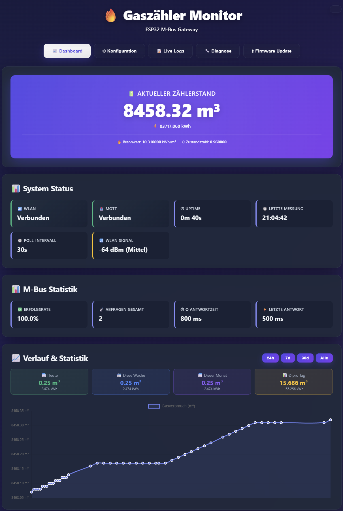

# 🏭 BK-G4AT2MQTT - ESP32 Gaszähler Gateway

> **Original Projekt von [BennoB666](https://github.com/BennoB666/BK-G4AT2MQTT)**  
> Dieser Fork wurde massiv erweitert mit professioneller WebUI, Live-Monitoring und umfangreichen Features.

Ein leistungsstarkes ESP32 Gateway zum Auslesen der M-Bus Schnittstelle eines **Honeywell BK-G4AT Gaszählers** mit vollständiger MQTT Integration und moderner Web-Oberfläche.

[](https://github.com/YOUR-USERNAME/BK-G4AT2MQTT/releases)
[](https://www.espressif.com/en/products/socs/esp32)
[](https://www.arduino.cc/)
[](https://mqtt.org/)
[](https://www.home-assistant.io/)
[](https://www.chartjs.org/)

---

## 📑 Inhaltsverzeichnis

- [Features](#-features)
- [Hardware Setup](#-hardware-setup)
- [Installation](#-installation)
- [WebUI Übersicht](#-webui-übersicht)
- [Home Assistant Integration](#-home-assistant-integration)
- [Konfiguration](#-konfiguration)
- [OTA Updates](#-ota-updates)
- [Fehlersuche](#-fehlersuche)
- [Technische Details](#-technische-details)

---

## ✨ Features

### 🎨 Moderne Web-Oberfläche

**Professionelles Glasmorphism Design** mit Dark/Light Mode

- **Dashboard**
  - Live-Anzeige: Gasverbrauch (m³) und Energie (kWh)
  - **Interaktiver Chart.js Verlaufs-Chart**
    - Professionelle Zeitachsen mit Auto-Skalierung
    - Zoom & Pan Funktionen
    - Zeitbereiche: 24h, 7 Tage, 30 Tage, Alle
    - Responsive Tooltips mit deutschen Datumsformaten
    - Smooth Linien mit Gradientenfillung
  - System-Status (WiFi, MQTT, Uptime)
  - M-Bus Statistiken & Erfolgsrate
  - Letzte Messungen Historie

- **Konfiguration**
  - WiFi & MQTT Einstellungen über WebUI
  - Brennwert & Z-Zahl Konfiguration
  - Poll-Intervall (10-3600s)
  - Statische IP (optional)
  - Keine Code-Änderungen nötig!

- **Live Logs** ⭐ NEU in v2.0
  - Echtzeit-Logging aller Ereignisse
  - **Hex-Dump** der M-Bus Rohdaten für Debugging
  - **Detaillierte Berechnungsanzeige** (Zählerstand, Brennwert, Z-Zahl)
  - Farbcodiert nach Typ (ESP, MQTT, M-Bus)
  - Icons für Status (✓ ❌ ⚠)
  - Auto-Refresh alle 3 Sekunden
  - Beispiel:
    ```
    M-Bus: Rohdaten - 68 1F 1F 68 08 00 72 43 53 69 26...
    MQTT: Energie - 83763.2 kWh (Zählerstand: 8451.83 m³, Brennwert: 10.36, Z-Zahl: 0.9607)
    ```

- **Netzwerk-Diagnose**
  - MQTT Verbindungstest
  - WiFi Signal & Qualität
  - Gateway Ping Test
  - **M-Bus Statistiken** mit durchschnittlicher Antwortzeit
  - **Fehlerstatistik-Reset** Button (löscht Fehlerzähler)
  - **System-Informationen** (Heap, Flash, Chip-Modell)
  - CSV Export der Historie

- **Firmware Update**
  - OTA via PlatformIO
  - Anleitung mit aktueller IP
  - USB-Fallback Option

### 🏠 Home Assistant Integration

- **MQTT Auto-Discovery** - Automatische Erkennung ohne YAML
- **5 Sensoren** werden automatisch angelegt:
  - `sensor.esp32_gaszaehler_zaehlerstand` - Gasverbrauch (m³)
  - `sensor.esp32_gaszaehler_gasverbrauch` - Energie (kWh) für Energy Dashboard
  - `sensor.esp32_gaszaehler_wifi` - WiFi Signal (dBm)
  - `sensor.esp32_gaszaehler_mbus` - M-Bus Erfolgsrate (%)
  - `binary_sensor.esp32_gaszaehler_online` - Verfügbarkeitsstatus
- **Energy Dashboard** kompatibel (`state_class: total_increasing`)
- **Availability Tracking** mit Last Will Testament
- **Brennwert-Berechnung** - Automatische kWh Konvertierung
- **Gerät im MQTT Device Registry** mit allen Sensoren gruppiert

### 📊 Erweiterte Energie-Funktionen

- **Brennwert-Umrechnung** (m³ → kWh)
- **Z-Zahl Korrekturfaktor** für präzise Messungen
- **Konfigurierbar** über WebUI (Standard: 10.0 kWh/m³)
- **Separate MQTT Topics** für Volumen und Energie
- **Persistente Speicherung** von bis zu 50 Messungen

### 🔧 System-Features

- **WiFi Access Point Modus**
  - Automatisch bei fehlender Konfiguration
  - SSID: `ESP32-GasZaehler`
  - Fallback nach 15s bei Verbindungsproblemen

- **NTP Zeit-Synchronisation**
  - Echte Zeitstempel für alle Messungen
  - Automatische Sommer-/Winterzeit (Europa)
  - Server: `de.pool.ntp.org`

- **Persistenter Speicher**
  - Konfiguration im Flash gespeichert
  - Messungen-Historie überlebt Neustarts
  - Automatisches Speichern alle 10 Messungen

- **Memory Management**
  - Automatische Ringbuffer-Verwaltung
  - Memory-Leak Schutz
  - Live Heap Monitoring

- **Fehlerbehandlung**
  - Detailliertes Error-Tracking
  - Automatisches Recovery
  - Statistiken: Timeouts, Parse-Fehler, Verbindungsprobleme

### 🎨 UI/UX Verbesserungen

- **Dark Mode als Standard** (umschaltbar)
- **Weißer Titel** statt Gradient für bessere Lesbarkeit
- **Responsive Design** für alle Geräte
- **CSS Animationen** (Fade-in, Slide-in, Pulse)
- **Farbcodierte Status-Anzeigen**
- **Progress Bars** für Erfolgsraten
- **Reorganisierte UI**: System-Info und Fehlerstatistik in Diagnose-Seite
- **Chart.js Integration** für professionelle Visualisierung
- **Accessibility** optimiert

---

## 🔌 Hardware Setup

### Benötigte Komponenten

- **ESP32 DevKit V1** (empfohlen) oder ESP32-C3
- **M-Bus Interface** (5V, UART)
- **Honeywell BK-G4AT** Gaszähler mit M-Bus

### Verkabelung


| ESP32 Pin | M-Bus Interface | Beschreibung |
|-----------|-----------------|--------------|
| **TX2** (GPIO17) | TX | UART Transmit |
| **RX2** (GPIO16) | RX | UART Receive |
| **GND** | GND | Masse |
| **5V** | VCC | Spannungsversorgung |

**Hinweis:** GPIO16/17 = UART2, Baudrate: 2400, 8E1 (8 Data, Even Parity, 1 Stop)

---

## 🚀 Installation

### 1. PlatformIO einrichten

```bash
# Repository klonen
git clone https://github.com/YOUR-USERNAME/BK-G4AT2MQTT.git
cd BK-G4AT2MQTT

# Dependencies werden automatisch installiert
pio run
```

### 2. Firmware flashen (USB)

```bash
# Kompilieren und Upload
pio run -t upload

# Mit Serial Monitor
pio run -t upload -t monitor
```

### 3. Erstkonfiguration (Access Point)

Nach dem ersten Flash:

1. **ESP32 startet im AP-Modus**
   - LED blinkt sehr schnell (100ms)
   - SSID: `ESP32-GasZaehler` erscheint

2. **Mit AP verbinden**
   - Passwort: `12345678`
   - Automatische IP: `192.168.4.1`

3. **WebUI öffnen**
   - Browser: `http://192.168.4.1`
   - **Konfiguration** Tab öffnen

4. **Einstellungen eingeben**
   ```
   WiFi:
   ├─ SSID: [Ihr WLAN Name]
   ├─ Passwort: [Ihr WLAN Passwort]
   └─ Hostname: ESP32-GasZaehler
   
   MQTT:
   ├─ Server: [MQTT Broker IP]
   ├─ Port: 1883
   ├─ Username: (optional)
   ├─ Passwort: (optional)
   └─ Topic: gaszaehler/verbrauch
   
   Gas-Konfiguration:
   ├─ Brennwert: 10.0 kWh/m³
   ├─ Z-Zahl: 1.0
   └─ Poll-Intervall: 60 Sekunden
   ```

5. **Speichern & Neustart**
   - ESP32 startet neu
   - Verbindet sich mit WLAN
   - IP-Adresse in Serial Console / Logs

6. **Zugriff über WLAN**
   - `http://[ESP32-IP]` oder
   - `http://ESP32-GasZaehler.local` (mDNS)

---

## 🌐 WebUI Übersicht

### Dashboard (`http://[ESP32-IP]`)



### Konfiguration

Alle Einstellungen editierbar:
- WiFi Credentials (SSID, Passwort, Hostname)
- Statische IP (optional)
- MQTT Server (IP, Port, Auth, Topic)
- Gas-Parameter (Brennwert, Z-Zahl)
- Poll-Intervall (10-3600s)
- WiFi Scanner für verfügbare Netzwerke

### Live Logs

```
[14:32:15] (1245s) 🚀 ESP32 Boot - System Start
[14:32:16] (1246s) 📶 WiFi verbunden: 10.10.40.109
[14:32:17] (1247s) 🔗 MQTT: Verbunden!
[14:32:45] (1275s) 📡 M-Bus: Poll gestartet
[14:32:47] (1277s) 📡 M-Bus: Antwort erhalten (42 Bytes, 156ms)
[14:32:47] (1277s) 📡 M-Bus: Rohdaten - 68 1F 1F 68 08 00 72 43 53 69...
[14:32:47] (1277s) 📡 M-Bus: Verbrauch OK - 1234.56 m³
[14:32:48] (1278s) 🔗 MQTT: Energie - 12345.6 kWh (Zählerstand: 1234.56 m³, Brennwert: 10.0, Z-Zahl: 1.0)
```

Farben:
- 🚀 **Blau** - System/Boot
- 📶 **Blau** - WiFi
- 🔗 **Cyan** - MQTT
- 📡 **Lila** - M-Bus
- ✓ **Grün** - Erfolg
- ❌ **Rot** - Fehler
- ⚠ **Gelb** - Warnung

**NEU in v2.0:**
- **Hex-Dump** zeigt erste 32 Bytes der M-Bus Rohdaten
- **Berechnungsdetails** bei MQTT Energie-Übertragung (zeigt Zählerstand, Brennwert, Z-Zahl)

### Netzwerk-Diagnose

**Tests verfügbar:**
- MQTT Verbindung (Server, Port, Auth, Antwortzeit)
- WiFi Status (Signal, Qualität, Kanal, MAC)
- Gateway Ping (Erreichbarkeit, Latenz, DNS)
- M-Bus Statistiken (Erfolgsrate, Ø Antwortzeit, Letzter Hex-Dump)
- **System-Informationen** (Heap, Flash, Sketch, Chip-Modell)
- **Fehlerstatistik** mit Reset-Button (löscht alle Fehlerzähler)
- CSV Export (Historie aller Messungen)

**API Endpoints:**
- `GET /api/diagnostics` - M-Bus Statistiken als JSON
- `POST /api/errors/reset` - Fehlerstatistik zurücksetzen
- `POST /api/mbus/trigger` - Manuelle M-Bus Abfrage triggern

---

## 🏠 Home Assistant Integration

### Automatische Einrichtung

Das Gateway sendet automatisch MQTT Discovery Nachrichten:

**MQTT Discovery Topics:**
```
homeassistant/sensor/esp32_gaszaehler_zaehlerstand/config
homeassistant/sensor/esp32_gaszaehler_gasverbrauch/config
homeassistant/sensor/esp32_gaszaehler_wifi/config
homeassistant/sensor/esp32_gaszaehler_mbus/config
homeassistant/binary_sensor/esp32_gaszaehler_online/config
```

**Konfiguration:**

Nach dem ersten MQTT Connect erscheinen automatisch:

1. **Einstellungen** → **Geräte & Dienste** → **MQTT**
2. Device: **ESP32 Gaszähler**
3. Sensoren:
   - `sensor.esp32_gaszaehler_zaehlerstand` - Verbrauch (m³)
   - `sensor.esp32_gaszaehler_gasverbrauch` - Energie (kWh)
   - `sensor.esp32_gaszaehler_wifi` - WiFi RSSI (dBm)
   - `sensor.esp32_gaszaehler_mbus` - M-Bus Erfolgsrate (%)
   - `binary_sensor.esp32_gaszaehler_online` - Online Status

### Energy Dashboard

**Energie-Sensor hinzufügen:**

1. **Einstellungen** → **Dashboards** → **Energie**
2. **Gas-Verbrauch** hinzufügen
3. Sensor auswählen: `sensor.esp32_gaszaehler_gasverbrauch`
4. Einheit: kWh
5. Fertig! Dashboard zeigt jetzt Gasverbrauch

**Dashboard Karte:**

```yaml
type: entities
title: Gasverbrauch
entities:
  - entity: sensor.esp32_gaszaehler_zaehlerstand
    name: Verbrauch
    icon: mdi:meter-gas
  - entity: sensor.esp32_gaszaehler_gasverbrauch
    name: Energie
    icon: mdi:lightning-bolt
  - entity: sensor.esp32_gaszaehler_wifi
    name: WiFi Signal
  - entity: sensor.esp32_gaszaehler_mbus
    name: M-Bus Qualität
  - entity: binary_sensor.esp32_gaszaehler_online
    name: Status
```

**Verlaufs-Graph:**

```yaml
type: history-graph
title: Gas Verlauf (7 Tage)
entities:
  - entity: sensor.esp32_gaszaehler_gasverbrauch
hours_to_show: 168
refresh_interval: 0
```

### MQTT Topics

| Topic | Beschreibung | Wert | Einheit |
|-------|--------------|------|---------|
| `gaszaehler/verbrauch` | Gasvolumen | `1234.56` | m³ |
| `gaszaehler/verbrauch_energy` | Energie | `12345.6` | kWh |
| `gaszaehler/verbrauch_wifi` | WiFi Signal | `-45` | dBm |
| `gaszaehler/verbrauch_mbus_rate` | M-Bus Rate | `98.5` | % |
| `gaszaehler/availability` | Status | `online`/`offline` | - |

**Hinweis:** Topics sind über WebUI Konfiguration änderbar (Base Topic: `gaszaehler/verbrauch`)

---

## ⚙️ Konfiguration

### Brennwert & Z-Zahl

**Brennwert (Heizwert):**
- Typisch: 8.0 - 12.0 kWh/m³
- Abhängig von Gasqualität
- Wird vom Gasversorger mitgeteilt
- Formel: `Energie (kWh) = Volumen (m³) × Brennwert × Z-Zahl`

**Z-Zahl (Zustandszahl):**
- Typisch: 0.95 - 1.00
- Korrigiert Druck & Temperatur
- Standard: 1.0 (wenn unbekannt)

**Einstellung im WebUI:**
1. **Konfiguration** Tab öffnen
2. Sektion **Gas-Konfiguration**
3. Werte eingeben
4. **Speichern & Neustart**

### Statische IP (optional)

```
Statische IP: [ ] Verwenden
IP-Adresse:   192.168.1.100
Gateway:      192.168.1.1
Subnetz:      255.255.255.0
DNS:          192.168.1.1
```

### MQTT Authentifizierung

```
MQTT Username: [optional]
MQTT Passwort: [optional]
```

Leer lassen für Broker ohne Auth.

---

## 🔄 OTA Updates

### Via PlatformIO (empfohlen)

**Methode 1: Terminal**
```bash
pio run -t upload --upload-port 10.10.40.109
```

**Methode 2: platformio.ini**
```ini
[env:esp32dev]
upload_protocol = espota
upload_port = 10.10.40.109  ; ESP32 IP-Adresse
```

Dann einfach:
```bash
pio run -t upload
```

### WebUI Anleitung

Das WebUI zeigt unter **Firmware Update** die aktuelle IP und Befehle an.

**Port:** ArduinoOTA läuft auf Port **3232**

---

## 🔍 Fehlersuche

### Problem: Keine WLAN-Verbindung

**Symptom:** LED blinkt schnell (200ms)

**Lösung:**
1. WLAN Zugangsdaten im WebUI prüfen
2. Router-Kompatibilität (2.4 GHz, WPA2)
3. Signal-Stärke im Diagnose-Tool prüfen
4. Factory Reset: BOOT-Button beim Start gedrückt halten

### Problem: Keine MQTT-Verbindung

**Symptom:** LED blinkt mittel (500ms)

**Lösung:**
1. MQTT Broker IP & Port prüfen
2. Firewall-Regeln prüfen (Port 1883)
3. MQTT Auth Credentials prüfen
4. Diagnose → MQTT Test ausführen

### Problem: Keine M-Bus Daten

**Symptom:** `M-Bus Timeout` in Logs

**Lösung:**
1. Verkabelung prüfen (TX↔RX, RX↔TX)
2. 5V Stromversorgung ausreichend?
3. M-Bus Interface funktionsfähig?
4. Gaszähler M-Bus Schnittstelle aktiviert?
5. Diagnose → M-Bus Stats → Hex-Dump prüfen

### Serial Monitor Logging

```bash
# PlatformIO Serial Monitor
pio device monitor -b 115200

# Farbige Ausgabe mit ANSI-Codes
```

**Wichtige Log-Meldungen:**
- `ESP32 Boot - System Start` - System gestartet
- `WiFi verbunden: [IP]` - WLAN OK
- `MQTT: Verbunden!` - Broker OK
- `M-Bus: Verbrauch OK` - Messung erfolgreich

### Factory Reset

**BOOT-Button beim Einschalten gedrückt halten:**
```
*** CONFIG RESET ERKANNT ***
Konfiguration gelöscht!
Starte im Access Point Modus...
```

Danach neu konfigurieren über AP.

---

## 📊 Technische Details

### System-Spezifikationen

| Parameter | Wert |
|-----------|------|
| **Microcontroller** | ESP32 (240 MHz Dual-Core) |
| **Flash** | 4 MB |
| **RAM** | 520 KB |
| **WiFi** | 802.11 b/g/n (2.4 GHz) |
| **UART** | UART2 (GPIO16/17), 2400 Baud, 8E1 |
| **WebServer** | Port 80 |
| **OTA** | Port 3232 (ArduinoOTA) |
| **MQTT** | 3.1.1 (PubSubClient) |

### M-Bus Protokoll

- **Baudrate:** 2400 bps
- **Format:** 8 Data Bits, Even Parity, 1 Stop Bit (8E1)
- **Poll Frame:** `10 5B 00 5B 16` (Hex)
- **Response Timeout:** 1000ms
- **Max Buffer:** 256 Bytes

### Speicher-Management

- **Konfiguration:** Preferences (Flash NVS)
- **Messungen:** Ringbuffer (50 Einträge)
- **Logs:** Ringbuffer (50 Einträge)
- **Auto-Persist:** Alle 10 Messungen
- **Memory Check:** Jede Minute

### Software-Architektur

```
ESP32 Firmware
├── Main Loop (Nicht-blockierend)
│   ├── WiFi Management
│   ├── MQTT Client
│   ├── M-Bus State Machine
│   ├── ArduinoOTA Handler
│   └── WebServer Handler
├── WebUI (Embedded HTML/CSS/JS)
│   ├── Dashboard (Live Updates)
│   ├── Configuration (Persistent)
│   ├── Live Logs (Auto-Refresh)
│   ├── Diagnostics (Tests)
│   └── Firmware Update (OTA)
└── Libraries
    ├── WiFi (ESP32 Core)
    ├── PubSubClient (MQTT)
    ├── ArduinoOTA
    ├── ESPmDNS
    ├── Preferences (NVS)
    └── ESP32Ping
```

### Dependencies (platformio.ini)

```ini
lib_deps = 
    knolleary/PubSubClient@^2.8
    mobizt/ESP32 Ping@^1.0

; Chart.js wird via CDN geladen (kein PlatformIO Dependency)
; https://cdn.jsdelivr.net/npm/chart.js@4.4.0
; https://cdn.jsdelivr.net/npm/chartjs-adapter-date-fns@3.0.0
```

### Compiler-Optimierungen

- **Partition Scheme:** Default (1.2 MB App / 1.5 MB SPIFFS)
- **Build Flags:** `-DCORE_DEBUG_LEVEL=0` (Release)
- **Monitor Speed:** 115200 Baud
- **Flash Frequency:** 80 MHz

---

## 🎯 Roadmap & Changelog

### ✅ Version 2.0.0 (Januar 2026)

**Neue Features:**
- ✅ **Chart.js Integration** - Professionelle Zeitachsen-Visualisierung
  - Auto-Skalierung (Stunden/Tage/Monate)
  - Smooth Linien mit Gradient
  - Interaktive Tooltips
  - Zeitbereich-Filter (24h/7d/30d/Alle)
- ✅ **Enhanced Live Logs** - Detailliertes Debugging
  - Hex-Dump der M-Bus Rohdaten (erste 32 Bytes)
  - Berechnungsdetails bei MQTT Übertragung
  - Zeigt Zählerstand, Brennwert, Z-Zahl
- ✅ **Reorganisierte UI** - Bessere Übersichtlichkeit
  - System-Informationen in Diagnose-Seite verschoben
  - Fehlerstatistik in Diagnose-Seite verschoben
  - Reset-Button für Fehlerstatistik
- ✅ **Weißer Titel** - Bessere Dark Mode Lesbarkeit
- ✅ **API Endpoints** - RESTful Schnittstellen
  - `/api/diagnostics` - M-Bus Stats JSON
  - `/api/errors/reset` - Fehler zurücksetzen
  - `/api/mbus/trigger` - Manuelle Abfrage
- ✅ **Home Assistant Discovery** - Optimiert
  - 5 Sensoren (inkl. Binary Sensor für Online Status)
  - Korrekte Entity IDs (`esp32_gaszaehler_*`)
  - Cleanup alter/doppelter Entities

### Version 1.x (Original Features)
- Dashboard mit Live-Anzeigen
- WebUI Konfiguration
- MQTT Integration
- M-Bus Auslesen
- WiFi Manager
- OTA Updates

### 🔮 Geplante Features

- [ ] **HTTPS** für WebUI
- [ ] **Passwort-Schutz** für WebUI
- [ ] **Backup/Restore** der Konfiguration
- [ ] **Telegram Benachrichtigungen**
- [ ] **Grafana Integration**
- [ ] **Multi-Language** Support (EN/DE)
- [ ] **Firmware Update** via WebUI Upload
- [ ] **RESTful API** Dokumentation
- [ ] **Prometheus Metrics** Export

---

## 🤝 Beitragen

Contributions sind willkommen!

1. Fork des Repositories
2. Feature Branch erstellen (`git checkout -b feature/AmazingFeature`)
3. Änderungen committen (`git commit -m 'Add some AmazingFeature'`)
4. Push zum Branch (`git push origin feature/AmazingFeature`)
5. Pull Request öffnen

---

## 👏 Credits & Danksagung

**Original Projekt:**  
[BennoB666/BK-G4AT2MQTT](https://github.com/BennoB666/BK-G4AT2MQTT) - Vielen Dank für das Basis-Projekt!

**Fork Maintainer:**  
Erweitert mit professioneller WebUI, Live-Monitoring, Energy Dashboard Integration und vielen weiteren Features.

**Libraries:**
- [PubSubClient](https://github.com/knolleary/pubsubclient) - MQTT Client
- [ESP32Ping](https://github.com/mobizt/ESP32-Ping) - ICMP Ping
- Arduino ESP32 Core Team

---

## 📄 Lizenz

Siehe [LICENSE](LICENSE) Datei für Details.

---

## 📞 Support

**Issues:** [GitHub Issues](https://github.com/YOUR-USERNAME/BK-G4AT2MQTT/issues)  
**Diskussionen:** [GitHub Discussions](https://github.com/YOUR-USERNAME/BK-G4AT2MQTT/discussions)

---

**⭐ Gefällt dir das Projekt? Gib einen Stern! ⭐**
